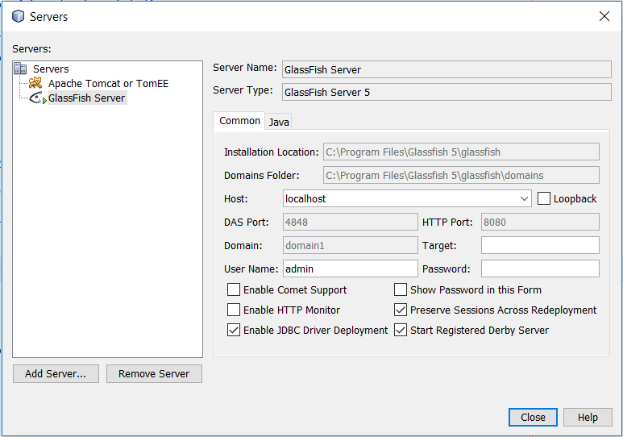
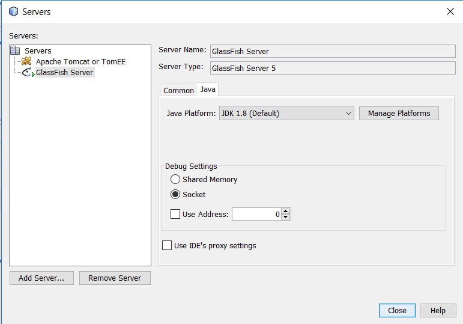
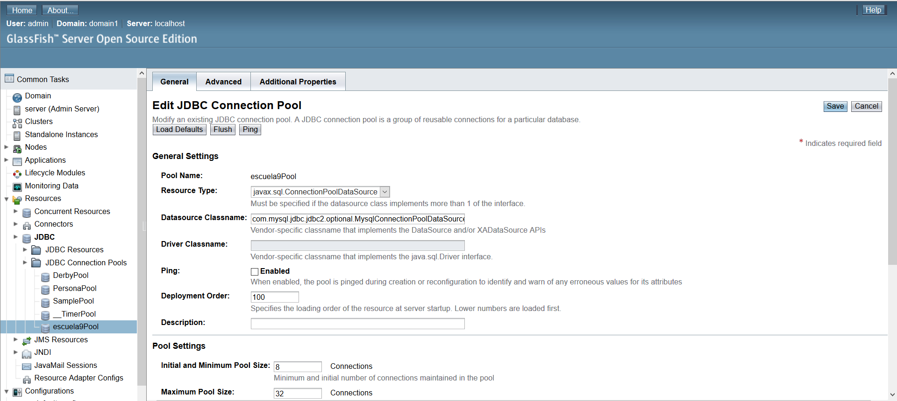
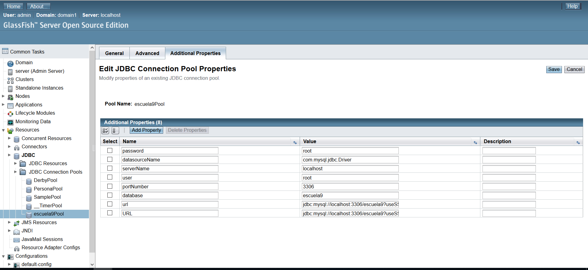
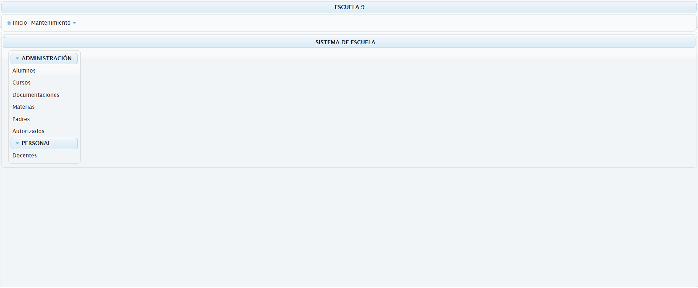

Tabla de Contenidos
=================
   * [CRUD aplicación web](#crud-aplicaci%C3%B3n-web)
      * [Frameworks y Herramientas usadas](#frameworks-y-herramientas-usadas)
         * [Lenguaje](#lenguaje)
         * [Persistencia](#persistencia)
         * [Presentación / GUI](#presentaci%C3%B3n--gui)
         * [Aplicación Servidor](#aplicaci%C3%B3n-servidor)
         * [Gestor de Repositorios y Construcción](#gestor-de-repositorios-y-construcci%C3%B3n)
         * [IDE](#ide)
      * [Propósito](#prop%C3%B3sito)
      * [Base de datos](#base-de-datos)
      * [Como correr este proyecto](#como-correr-este-proyecto)

# CRUD aplicación web
Este proyecto es un simple CRUD que utiliza Java + JSF + JPA + JTA y otras tecnologías.

## Frameworks y Herramientas usadas
### Lenguaje
* Java 8 (JDK 1.8)
### Persistencia
* JPA 2.1
* Eclipselink 2.7.2
* MySQL 5.7.x
### Presentación / GUI
* JSF 2.3
* Primefaces 6.2
### Aplicación Servidor
* Glassfish 5.0
### Gestor de Repositorios y Construcción
* Maven 4.0
### IDE
* Netbeans IDE 8.2

## Propósito
El principal propósito de este proyecto es servir como ejemplo para quienes deseen implementar las tecnologías anteriormente nombradas.

## Base de datos
La base de datos fue hecha en Workbench 6.3 CE a traves de un modelo. En la carpeta BD está el modelo ER y el script SQL.
1. Ejecutar el script SQL para crear la base de datos.
2. Cargar algunos datos a la BD (Alumnos, cursos,etc)

## Como correr este proyecto
1. Descargar **Glassfish 5.0** desde https://javaee.github.io/glassfish/download y extraer en C:\Program Files
2. Abrir **Netbeans IDE**, ir a **Window**, "**Services**" (Ctrl+5), click derecho sobre "**Servers**" sleccionar "**Add Server...**". Seleccionar "**Glassfish Server**", botón "**Next**". En "**Server Location**", buscar la carpeta donde previamente se extrajo Glassfish.
3. Botón **Next** dejar los valores por defecto excepto el **User Name** que será 'admin' y presionar **Finish**
4. En la ventana "**Services**", click derecho sobre el servidor recien creado y seleccionar "**Properties**". En la pestaña "**Java**", buscar **JDK 1.8** en "**Java Platform**" **desmarcar** "**Use IDE Proxy Settings**", como se muestra a continuación.

5. Descargar conector MySQL 5.1.46 desde http://central.maven.org/maven2/mysql/mysql-connector-java/5.1.46/mysql-connector-java-5.1.46.jar y copiar en la carpeta /glassfish/domains/domain1/lib/
6. Click derecho sobre el servidor recien creado, "**View Domain Admin Console**" en el menú izquierdo en la pestaña "**Resources**" seleccionar "**JDBC**",
luego "**JDBC Connection Pools**" y debe quedar como en la siguiente imagen: 

7. Ahora ir a "**JDBC Resources**" botón  "**New**" en el campo "**JNDI**" ingresar 'jdbc/escuela9' en "**Pool Name**" 'escuela9Pool' creado en el anterior paso.
8. Clone/Fork este proyecto a tu PC y abrelo en NetBeans ("**File**" / "**Open Project...**" menu)
9. Botón derecho sobre el proyecto, "**Properties**" después "**Run**" y en "**Server**" seleccionar Glassfish 5. Presionar "**Ok**"
10. Click derecho sobre el proyecto, seleccionar "**Clean and Build**" para descargar las dependencias, luego "**Run**", espera a que cargue Glassfish, si el navegador no se abre automaticamente, ir a http://localhost:8080/escuela-9 . Deberias ver algo así:

